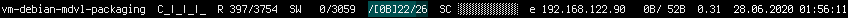
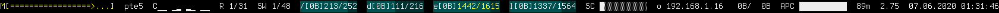

Summary
=======

This repository contains a collection of different scripts for configuring a
_status bar_. The most recent script version works in combination with
[i3bar(1)](https://manpages.debian.org/stable/i3-wm/i3bar.1), older versions
work with [conky(1)](https://manpages.debian.org/stable/conky-all/conky.1).

The installable Debian package can be created by running `ant package`.

Introduction
============

A _status bar_ can be used to display system information. Usually, date and time
information is provided along with other information the user may consider
useful.

For example, some people display the state of multimedia applications, others
display network information like IP addresses and hostnames and some like to
have a permanent glance at the system's load in terms of disk usage, processor
load, memory etc.

Background
==========

Programs like [conky(1)](https://manpages.debian.org/stable/conky-all/conky.1)
and [i3status(1)](https://manpages.debian.org/stable/i3status/i3status.1) exist
to aid in solving this task, but require extensive and often machine-dependent
configuration. The necessity for configuration is natural, as the design and
rationale behind a good status bar seems to be a very personal thing.

However, being machine-dependent is not really a “nice” property for people who
know their personal status bar style but want to use their configuration across
many systems. In these cases one either has to edit the configuration for every
system or come up with some kind of automation.

This repository provides exactly that: Some examples of more or less advanced
automated status bar “creation“ for a single user's personal configuration
style. As a result, it is most unlikely that anybody will use the provided
scripts or status bar directly, but it may serve as an inspiration of how to
go about it. Additionally, for the most recent version, the reasons for
including specific figures in the status bar output are explained with the
expectation that this may serve a user who wants to thoughtfully craft their
own status bar.

Auxiliary Scripts
=================

On the way towards creating a status bar, one may be tempted to create scripts
to simplify processing some status information. Beware that calling external
processes from status bars can be resource-intensive.

That warning given, here are two scripts which may be useful in other contexts
than status bars, too:

## `ma_perc_bar` -- progress bar

Script `ma_perc_bar` is the absolute minimum of a status-bar script. It takes
as input a number from 0 to 100 (both inclusive) and outputs a progress bar
made of block characters.

Example:

~~~
$ ./ma_perc_bar 30
███░░░░░░░
~~~

The idea here is that the script may be used in rarely-called status scripts
or may serve as a building block for conky configuration generation scripts
(see section `ma_genconkyconf_new`)

## `ma_acpi_status` -- formatted ACPI output

Uses `ma_perc_bar` to format the output of the `acpi` command. This is
intended to be called rarely (e. g. once per minute) to output Laptop battery
status information as part of a possibly larger status bar.

Example:

	$ ./ma_acpi_status
	D █████████░ 96% 10:17:57

The Legacy
==========

The Ma_Sys.ma journey through status bars was roughly like this:

 * XFCE (3?) integrated status bar. That time, mostly disk usage and CPU load
   were checked and space was used rather inefficiently.
 * Standalone conky. Initially a hand-crafted configuration file and soon a
   script to generate a configuration file dependent on the presence of
   certain file systems and information on different machines. There was only
   one script this way, but a few machine-specific lines here and there.
   See section `xond/ma_genconkyconf`.
 * Conky and i3bar. For integration with the i3 window manager, it turned out
   to be nice using the i3bar e.g. as to display and be able to change the
   different workspaces etc. Integration with i3bar is either text only or
   colorized text by using a JSON interface. `ma_genconkyconf_new` used
   this approach to generate a conky configuration which could be used in
   combination with wrapper script `ma_i3conkystatus` to output a colorized
   status bar in i3bar.
 * `mai3bar` and i3bar. This (new!) variant is the first not to contain
   strictly machine-specific code and also the first for a long time to not
   rely on conky for gathering system information. See section
   _Current Ma_Sys.ma i3bar_ for details.

## `xond/ma_genconkyconf`

The script in `xond/ma_genconkyconf` contains instructions to generate a status
bar for standalone Conky usage which used to look like this:

Back then, conky had a different configuration file format which means that by
now, the script is no longer compatible with new Conky versions and hence only
of historic interest.

The following items were in the status bar.

### First row

 * CPU information in red. The first gauge displays the overall CPU load and
   the followup gauges display the individual processor cores. The script was
   intended to distinguish different physical processor cores by leaving a
   little space. In the example screenshot, it displays four physical cores
   (because it is running in a virtual machine, it cannot know that it only
   has e.g. two physical cores).
 * Screenindex information in gray. The SCR gauge visualizes the output of
   `screenindex -v d current -r`, see [screenindex(32)](screenindex.xhtml) for
   details.
 * Red text which may contain CPU temperature information if detected, inside
   the VM that is just `N_SUPPORT` to indicate _not supported_.
 * The system load averages
 * The current date and time in `dd.MM.YYYY HH:mm:ss` format.

### Second row

 * RAM usage in green.
 * Swap usage in cyan (SWP).
 * Disk usage in blue (SYS). The script considers some specific Ma_Sys.ma
   mountpoints to display as additional gauges here, if they are present.
   By default, however, it only shows the disk usage of the root filesystem.
 * Network information across all interfaces from left to right:
   total data uploaded, total data downloaded, current upload speed,
   current download speed (yes, the VM was downloading from local network
   with 95.4 MiB/s!)

### Evaluation

Most of the information selected for being displayed back then, is still
considered interesting in the most recent Ma_Sys.ma status bar versions.
However, some measures have been taken to reduce the space occupied for
things which may not require large gauges. Today, you can really see that
the design from `xond/ma_genconkyconf` was not intended to display more than
four or eight processor cores.

Standalone conky works well for stacking window managers. Back then, Fluxbox
was being used, but others are expected to work, too. For tiling window
managers, there was often need for additional configuration, but at least i3
and spectrwm allow for conky to be used as a “standalone” status bar.

## `ma_genconkyconf_new`

For about five years, this was the prevalent status bar used at the Ma_Sys.ma.
It ran on a few physical as well as virtual machines and supported
energy-efficient laptop as well as desktop usage.

To use screen space efficiently, this status bar uses only a single line.
In terms of colors, it closely resembles its predecessor. The following
information is displayed:

 * System hostname (recent versions like the one included in the repository
   also included the IP address)
 * red CPU load gauge for all cores together
 * red indivudal tiny vertical CPU load gauges for each individual core.
   Like before, some automation to detect Hyperthreading etc. is part of the
   script to generate the configuration file.
 * green RAM gauge (displays as empty in the example, because the VM has much
   more RAM assigned than used)
 * cyan Swap gauge
 * blue root filesystem disk usage gauge
 * grey Screenindex gauge
 * Magenta network information. The first (unlabelled) entry displays the
   current upload/download activity. The other (potentially multiple) entries
   display the totally uploaded and downloaded data by interface. The leading
   `0` indicates that the interface's name ends on 0 (e. g. `eth0`).
 * One-Minute Load average indicator
 * Local time

Some system-specific code allows special file systems to appear as additional
gauges. Automatic detection of the `apcupsd` daemon or the use on a Laptop
allow for battery monitoring gauges to appear on those systems, where they
make sense.

The configuration format is already conky's new format such that script
`ma_genconkyconf_new` may still be used if one wants to create a similar
status bar.

The disadvantage of the integration with i3bar is complexity: To generate the
JSON output needed by i3bar, a very convoluted Conky configuration file is
generated and one cannot run conky directly from i3bar -- a wrapper script for
displaying a leading `{"version:1"}[` string is needed. Additionally, conky
occasionally crashed when network interfaces were changing or ACPI information
was garbled.

### Other noteworthy features

 * Script `ma_genconkyconf_new` can be used in conjunction with a standalone
   conky if called with the `-t` option instead of `-j`.
 * Temperature information is displayed if detected (some potential sensors
   for Ma_Sys.ma computers are hard-coded in the script...)

## `ma_i3conkystatus`

In case you are interested in running `ma_genconkyconf_new` in conjunction with
i3bar, the steps are as follows:

 1. Generate a Conky configuration file:
    `ma_genconkyconf_new -j > ~/.mdvl/conkyrc_i3`
 2. Configure to use `ma_i3conkystatus` in i3. This script in turn invokes
    `conky` with the configuration file generated in the previous step and
    produces the static part of the necessary output for i3bar integration.
    Additionally, in case of conky crashes, it attempts to re-start conky
    without leaving i3bar in an error state.
 3. Restart/Reload i3 for the changes to take effect.

Here is an example of an i3 configuration file snippet to invoke
`ma_i3conkystatus`.

	bar {
		status_command /usr/bin/ma_i3conkystatus
		position top
		tray_output primary
		colors {
			#                   border  bg      fg
			focused_workspace   #cc4040 #cc4040 #ffffff
			active_workspace    #806060 #806060 #aaaaaa
			inactive_workspace  #201818 #201818 #505050
			urgent_workspace    #ffaa00 #ffaa00 #ffffff
			background                  #000000
			statusline                          #ffffff
			separator                           #333333
		}
	}

Current Ma_Sys.ma i3bar
=======================

The current Ma_Sys.ma status bar is no longer dependent on conky. Instead, it
is a Perl script which directly outputs JSON that can be processed by i3bar.
Most notable change compared to the previous variants is the use of less colors:
Instead of coloring different ressource types differntly, `mai3bar` colors
resources depending on whether they can be considered to be in a critical,
warning or normal state. This is intended to have the following advantages:

 * Draw less attention to the status bar as to focus more on the actual
   problems at hand.
 * Use less space for less important metrics (e.\,g. CPU and RAM) but draw
   attention to them if they are critical by means of color.

Additionally, no longer using conky, it becomes feasible to implement gauges
which have text written _on_ them. This allows for higher density in
information. Additionally, actual _figures_ can be presented for resources
like disk space and RAM. While it might seem a minor detail, having these values
as numbers is useful in the context of virtual and old machines where limits
might be very low e.\,g. for RAM or disk space compared to what one expects from
modern physical systems.

Here are a few other newly added features compared to the previous status bars
used at the Ma_Sys.ma. A few of them are somewhat experimental because they may
not fit the common expectations of how values would appear in a status bar:

 * The CPU load gauges' layout provides more advanced CPU topology information
   as detected by an integrated copy of Perl package `CpuTopology`.
 * Automatic choice of units for displayed metrics: For storage and RAM, current
   systems may have a wide range from a few gigabytes to terabytes. As a result,
   there does not seem to be a one size fits all unit of measure and hence, the
   status bar automatically chooses between megabytes and gigabytes for RAM and
   file systems. On systems with little RAM (e.g. 4 GiB), RAM is displayed
   in megabytes, whereas on systems with much RAM (e.g. 16 GiB), RAM is
   displayed in GiB. As there is currently no explicit indicator for which
   unit is being used, there is some potential for confusion here and new
   status bar versions might add a (potentially indirect) indicator for the
   unit of measure.
 * To give compact (e.g. one or two letter) names to file systems and network
   interfaces, a special _name shortening algorithm_ is integrated.
 * The refresh interval of the status bar uses different (hard-coded) delays
   depending on the situation:
   If a discharging laptop battery is detected, the refresh rate is once every
   20 sec. Under regular circumstances, the refresh rate is once per second and
   it may slow down if slow processing is noticed (as not to give too many of
   the scarce resources to status bar computation).
 * The refresh interval of the status bar is attempted to be aligned to the
   actual turning of seconds such that the clock is expected to be more accurate
   than with other status bars.

Summary of items displayed:

 * MDADM RAID resync progress (only if happening at the time)
 * Hostname
 * `C` for CPU indicates a CPU section with vertical gauges for each processor
   (core).
 * `R` for RAM indicates the RAM memory section with figures in GiB (if
   total RAM large) or MiB (if total RAM small) .
 * `SW` for Swap indicates the use of swap space. At the time of the
   screenshot there were 48 GiB swap and 1 GiB of it used.
 * Filesystem sections. For each file system, the structure is as follows:
   FS name (`/`, `d`, `e`, `l` ... as generated by the name shortening
   algoritm), filesystem usage, total filesystme size.
 * `SC` section if [screenindex(32)](screenindex.xhtml) is installed.
 * Network interface sections. For each interface:
   Interface name as generated by the name shortening algorithm,
   IP address, current upload speed, current download speed (units displayed and
   dynamically adjusting to the order of magnitude).
 * In case it reports a battery level and is installed, a formatted output
   of [acpi(1)](https://manpages.debian.org/buster/acpi/acpi.1.en.html)
   will be displayed (useful for mobile devices),
 * APC UPS section if [apcupsd(8)](https://manpages.debian.org/stretch/apcupsd/apcupsd.8.en.html)
   is installed. Displays the battery's fill level and the estimated time the
   system could run on battery under current load.
 * Load AVG section
 * Date and Time section (`DD.MM.YYYY hh:mm:ss`)

## Name Shortening Algorithm

In order to display the names of file systems and network interfaces in a
recognizable and compact fashion, a special algorithm for shortening the names
of file system mountpoints and network interfaces has been devised. It should
still be considered experimental, but seems to work in many “common” cases so
far.

The algorithm does the following steps:

 1. Given a _list of names_ to process.
 2. Sort the _list of names_ (lexicographically) to obtain a _sorted list_
 3. Process names starting from the first item in the _sorted list_.
    For the current and all subsequent names in the sorted list.
    Remove their longest common prefix.
 4. Continue with the _prefix reduced list_.
 5. Process each item in the prefix reduced list:
 6. Take the shortest prefix of the item such that it is not a prefix of any
    other item in the list.
 7. Output the resulting names.

Example shortenings:

Input             Prefix Reduced List  Output
----------------  -------------------  ----------
eno1, ens1        o1, s1               o, s
eno1, eno2, ens1  o1, o2, s1           o1, o2, s
/*, /data,        /, data, e01, ll     /, d, e, l
/fs/e01, /fs/ll

*) As a special execption, an empty string is kept to be `/` instead of being
reduced to the empty string for being a prefix of each other entry.
